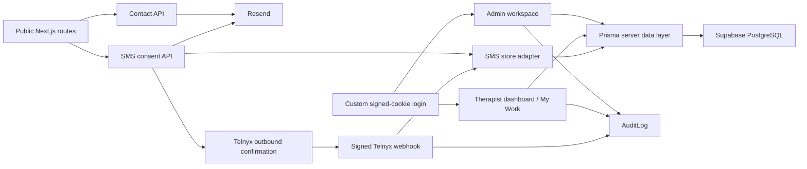
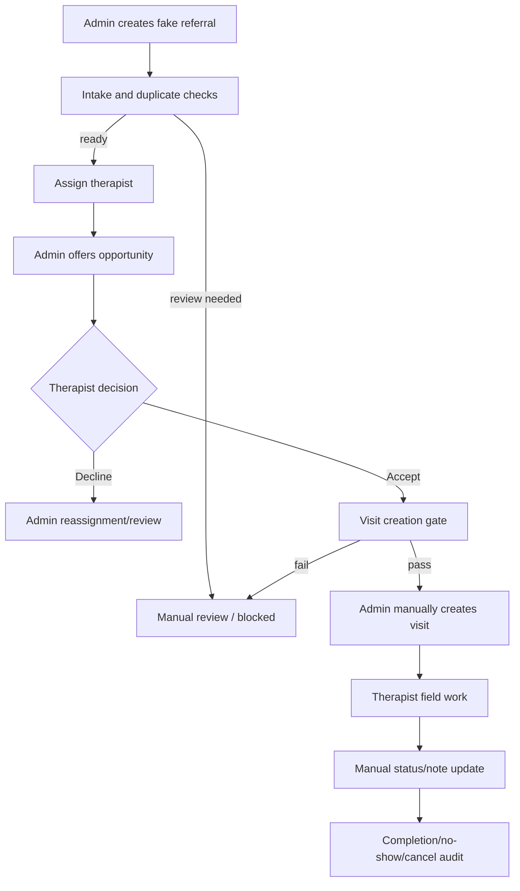

# Flowvia Codex Capability and Product Baseline Audit V1

Audit date: 2026-07-22  
Repository: `mimakeko/flowviahealth`  
Audited commit: `1c84831bf8f80fefa2ac88c2c2a8eacbbaae5fcd`  
Audit branch: `codex/baseline-audit-v1`  
Safety boundary: read-only external-service assessment; local isolated synthetic-data validation only

## 1. Executive summary

### Overall result

`WARN_READY_WITH_BOUNDED_REMEDIATION`

Flowvia is a coherent, production-deployed pilot application with aligned GitHub, Vercel, and Prisma state; working role boundaries; deterministic no-PHI guardrails; a strong therapist field workspace; and unusually broad smoke-test coverage for its size. The application is ready for a bounded UI and explainable-routing phase after four focused remediations:

1. Explicit logout leaves both login fields populated by browser restoration. This is a credential-handling defect on shared devices even though the session cookie is cleared.
2. Referral detail can simultaneously present `Ready to create visit`, `review only`, and `Create visit is suppressed until therapist acceptance is recorded`. The underlying gates are safe, but the product state communicated to the user is contradictory.
3. The shared `/dashboard` mobile and tablet shell renders navigation and policy chrome before work. On a 390 x 844 admin viewport, the main content begins about 1,250 px down; on a 768 x 1024 tablet, it begins about 1,026 px down.
4. Vercel reports two `/api/sms-consent` runtime error events in the last seven days. Detailed runtime lines are no longer retained, so the cause is unproven. Connected-service health must be checked before attributing the errors to application code.

No production deployment, database row, schema, Vercel setting, DNS record, Telnyx setting, Resend setting, email, SMS, GitHub commit, push, or pull request was created or changed by this audit.

### What is trustworthy now

- Local `HEAD`, `origin/main`, GitHub `main`, and the latest Vercel production deployment all resolve to the same commit.
- The latest production deployment is `READY`, source `git`, target `production`, and serves the expected production aliases.
- The one repository Prisma migration is recorded as applied in the hosted database's Prisma migration ledger.
- The hosted Supabase project is `ACTIVE_HEALTHY` on PostgreSQL 17.
- GitHub, Vercel, Supabase, and Resend read connectors are authenticated.
- Resend's `flowviahealth.com` domain is verified with sending enabled.
- Admin and therapist authorization boundaries behave correctly in the rendered application.
- The production-aligned build passes lint, TypeScript, production build, deterministic guardrail smokes, isolated database smokes, and authenticated Playwright smoke.
- The therapist `/my-work` mobile view is content-first, has no horizontal overflow, and clearly exposes the next field action.

### Top five product opportunities

1. Make referral workflow state canonical across dashboard, queue, detail, scheduling, and My Work.
2. Make `/dashboard` content-first on phone and tablet, using the successful `/my-work` shell pattern.
3. Reduce repeated policy and deterministic-guidance panels; disclose detail on demand after a concise action/state summary.
4. Add explainable therapist recommendations inside existing referral and My Work surfaces, not as a new standalone page.
5. Turn SMS-consent failures into diagnosable, service-aware operational signals without logging PHI or provider payloads.

### Top five technical risks

1. Shared role credentials plus browser-restored form values after logout.
2. Referral state is distributed across referral status, visit status, intake calculations, and opportunity audit events, allowing contradictory UI.
3. Opportunity state is reconstructed from `AuditLog` rather than stored in a constrained domain model.
4. No GitHub Actions workflow enforces the strong local test suite on pushes or pull requests.
5. Production service configuration cannot be fully verified from the current connector surface; Telnyx account health and deployed environment-variable names remain unconfirmed.

## 2. Codex capability inventory

The current Codex surface exposes 467 callable tools, including 436 MCP tools. The MCP servers visible in this session are `codex_apps`, `node_repl`, `xcodebuildmcp`, `dataAnalyticsWidgets`, `openai_api_key_local_confirmation`, and `sites_design_picker`. Flowvia-relevant installed plugin/skill groups include GitHub, Vercel, Supabase, Resend app tools, Browser/Chrome control, web frontend building/testing, React/Next.js guidance, data analytics, documents, PDFs, presentations, spreadsheets, and visualization. Unrelated travel, finance, design, Apple-development, and artifact tools are available but were not used.

### Flowvia-relevant capability matrix

| Capability | Available | Authenticated | Read actions | Write actions exposed | Flowvia value | Approval-gated / missing |
|---|---|---|---|---|---|---|
| Local filesystem and shell | Yes | Local OS context | Repository, config, source, process, and command inspection | File edits and local processes | Architecture review, tests, local isolated validation | Destructive filesystem actions; no broad deletion |
| Local git | Yes, 2.53.0 | Remote uses GitHub HTTPS credential path | Status, history, refs, diff, fetch/dry-run | Branch, commit, push | Alignment and change control | Commit/push/force/ref deletion require explicit task scope |
| GitHub CLI | Yes, 2.96.0 | Yes, account `mimakeko` | Repo/commit/run/API reads | Token has repo/workflow-capable scopes | Main-SHA and CI inspection | Push, PR, issue, workflow rerun, settings changes |
| GitHub MCP/app | Yes | Yes | Repo, commit, PR, issue, workflow, permission reads | Broad repo/PR/issue write tools exposed | Structured GitHub inspection | All writes remain approval-gated; not used |
| Vercel MCP/app | Yes | Yes | Teams, projects, deployments, build logs, runtime logs/errors | Deploy and toolbar-feedback tools exposed | Deployment alignment and runtime health | Deploy, promote, rollback, domains, env, project changes; no env-list tool is exposed |
| Vercel CLI | No | Not applicable | None locally | None locally | Would support direct env-name/log/project inspection | Install and authenticate only in a separately approved task |
| Supabase MCP/app | Yes | Yes | Projects, tables, migration ledger, logs, advisors, read-only SQL | SQL, migration, branch, project, and Edge Function writes exposed | Hosted DB/migration/security baseline | DDL/DML/project/config writes are approval-gated and were not used |
| Supabase CLI | No | Not applicable | None locally | None locally | Would support local stack and migration parity workflows | Install/link only when approved; MCP currently covers reads |
| Resend MCP/app | Yes | Yes | Domains, webhooks, emails, logs, templates, contacts | Send/create/update/delete tools exposed | Domain and delivery integration checks | Sending email, API-key/domain/webhook changes are approval-gated and were not used |
| Telnyx direct tool/CLI | No | Unverified | No account/service-health reads | No direct writes | App code and Vercel errors can be inspected only indirectly | A read-only Telnyx health/log capability is missing |
| Node.js | Yes | Not applicable | Local runtime | Local execution | Build and scripts | System Node is 26.4.0; Vercel is 24.x. Bundled Node 24.14.0 was used for parity |
| pnpm | Yes, 11.9.0 | Not applicable | Dependency/scripts inspection | Installs local dependencies | Deterministic project commands | Package changes require task scope; frozen lockfile install only was used |
| Prisma | Yes, project 7.8.0 | Local isolated DB and read connector to hosted state | Generate/schema/migration ledger reads | Migration and DB writes are supported | Schema and migration verification | Production migration/DDL/DML is approval-gated; no production write occurred |
| PostgreSQL CLI | `psql` available | No hosted connection was used | Local/approved DB queries | SQL writes possible | Isolated local test database | Never use hosted credentials or write SQL without explicit scope |
| Playwright | Yes, 1.61.1 | Local synthetic login only | Rendered DOM, layout, RBAC, screenshots | Browser interactions can submit forms | Responsive workflow review | Existing config has desktop Chromium only; production authenticated login was intentionally avoided |
| In-app Browser | Yes | Browser available | Production public UI and local authenticated UI | Can interact with pages | Visual and responsive product audit | No production form submission or authenticated login during this audit |
| Vercel observability | Yes through MCP | Yes | Aggregated runtime errors, status-code counts, build logs | No observability write used | Service-aware diagnosis | Detailed log retention did not cover the older error events |
| GitHub Actions | Platform available | GitHub authenticated | Run listing | Workflow writes exposed via GitHub tools | CI enforcement | Repository currently has no workflow runs/workflows |

### Relevant connected app status

- Connected and authenticated: GitHub, Vercel, Supabase, Resend.
- Browser runtime available: in-app browser plus Playwright-backed local verification.
- Direct service capability missing: Telnyx.
- Local CLI missing: Vercel and Supabase.
- Recommended-but-uninstalled productivity connectors such as Slack, Gmail, Google Drive, Notion, Teams, and Atlassian are not required for this baseline.

## 3. Connected-service status matrix

| Service | Status | Evidence | Current limitation / action |
|---|---|---|---|
| GitHub | Connected, authenticated, repository accessible | Repo metadata, admin/push/pull permissions, `gh auth status`, GitHub `main` SHA | Repository is public; latest commit is unverified; no CI workflows/runs |
| Vercel | Connected, authenticated, production `READY` | Project metadata, production deployment, aliases, build logs, runtime error aggregation | No deployed env-name listing in connector; detailed older runtime logs expired |
| Supabase | Connected, authenticated, `ACTIVE_HEALTHY` | Project metadata, table inventory, Prisma ledger query, logs, advisors | Direct Supabase CLI absent; Data API grants/settings were not exposed |
| PostgreSQL | Healthy hosted engine, Prisma-aligned | PostgreSQL 17.6 project metadata; applied Prisma migration | Connector's Supabase migration list is empty because Prisma uses `_prisma_migrations`; this is not schema drift |
| Resend | Connected, authenticated | `flowviahealth.com` verified, sending enabled, no webhooks | Delivery logs were not needed; no message was sent |
| Telnyx | App integration present; account health unverified | API key/profile/from-number/signing env names; consent and webhook routes; deterministic smokes | No direct Telnyx connector/CLI. Check Telnyx/Vercel service health before assigning SMS errors to code |
| DNS/domains | Production aliases resolving | Browser loaded `flowviahealth.com`; Vercel lists four aliases | No DNS mutation or detailed registrar inspection performed |

### Environment-variable name inventory

Names found in source and configuration, never values:

- Core/database: `DATABASE_URL`, `DIRECT_URL`, `NODE_ENV`, `VERCEL_ENV`, `FLOWVIA_DEPLOY_TARGET`, `FLOWVIA_BASE_URL`, `FLOWVIA_OPERATIONS_TIME_ZONE`.
- Pilot gates/data: `FLOWVIA_PILOT_OPERATIONS_ENABLED`, `FLOWVIA_ADMIN_MESSAGES_ENABLED`, `FLOWVIA_DATA_MODE`, `FLOWVIA_SMS_STORE_MODE`.
- Authentication: `FLOWVIA_ADMIN_EMAIL`, `FLOWVIA_ADMIN_PASSWORD_HASH`, `FLOWVIA_THERAPIST_EMAILS`, `FLOWVIA_THERAPIST_PASSWORD_HASH`, `FLOWVIA_SESSION_SECRET`.
- Email: `RESEND_API_KEY`, `CONTACT_TO_EMAIL`, `CONTACT_FROM_EMAIL`.
- Telnyx: `TELNYX_API_KEY`, `TELNYX_MESSAGING_PROFILE_ID`, `TELNYX_FLOWVIA_FROM_NUMBER`, `TELNYX_WEBHOOK_SIGNING_SECRET`, `FLOWVIA_ALLOW_REAL_SMS_TEST`, `FLOWVIA_ALLOW_UNSIGNED_TELNYX_WEBHOOK_TEST`, `FLOWVIA_PERSONAL_TEST_PHONE`.
- AI guardrails: `FLOWVIA_AI_ENABLED`, `FLOWVIA_AI_PROVIDER`, `FLOWVIA_AI_NO_PHI_MODE`, `FLOWVIA_AI_AUDIT_ONLY`, `FLOWVIA_AI_ALLOW_REAL_PROVIDER_NO_PHI`.
- Smoke/test selectors: the `FLOWVIA_*_SMOKE_*`, `FLOWVIA_CLOUD_SMOKE_BASE_URL`, and `FLOWVIA_READINESS_TARGET` variables documented in `.env.example` and scripts.

The current Vercel connector cannot list deployed variable names. Therefore this audit confirms required names from code/manifests and runtime behavior, not the complete Vercel environment inventory.

## 4. Repository and deployment alignment

| Layer | Commit / migration | Result |
|---|---|---|
| Local `HEAD` | `1c84831bf8f80fefa2ac88c2c2a8eacbbaae5fcd` | Aligned |
| Local `origin/main` | `1c84831bf8f80fefa2ac88c2c2a8eacbbaae5fcd` | Aligned |
| GitHub `main` | `1c84831bf8f80fefa2ac88c2c2a8eacbbaae5fcd` | Aligned |
| Latest Vercel production | `1c84831bf8f80fefa2ac88c2c2a8eacbbaae5fcd` | Aligned, `READY` |
| Repository Prisma migration | `20260702130000_field_pilot_foundation` | Present |
| Hosted `_prisma_migrations` | `20260702130000_field_pilot_foundation`, finished, not rolled back | Aligned |

### Deployment details

- Vercel project: `flowviahealth`.
- Framework/runtime: Next.js, Node 24.x, one Node lambda runtime reported.
- Deployment source: GitHub `main` through Vercel Git integration.
- Latest build: completed successfully; no build errors returned.
- Production domains: `flowviahealth.com`, `flowviahealth.vercel.app`, the project alias, and the `git-main` branch alias.
- Recent production response counts returned by Vercel: 379 `200`, 68 `304`, 5 `307`, 4 `303`, and 2 `405` among the top grouped statuses.
- Aggregated runtime error: two occurrences of `Flowvia SMS consent route failed.` on `/api/sms-consent` between 2026-07-14 and 2026-07-20.
- Detailed error logs were unavailable for that older window under current retention. Root cause is undetermined.
- GitHub reports no Actions workflow runs. Deployment is Vercel Git-driven, not GitHub Actions-driven.
- Latest GitHub commit signature/verification state is unverified.

### Supabase and migration notes

- Project name: `flowviahealth-staging`.
- Region: US East (Ohio); status `ACTIVE_HEALTHY`; PostgreSQL 17.
- Public tables: `_prisma_migrations`, `Therapist`, `PatientReferral`, `Visit`, `SmsConsentEnrollment`, `SmsMessage`, `TelnyxWebhookEvent`, `AuditLog`.
- All reported tables have RLS enabled and no policies. This fails closed for Data API roles, while the server-side Prisma connection uses its database role. Confirm Data API grants/settings before any browser Supabase client is ever introduced.
- Supabase's platform migration-list tool returns no platform migrations because Flowvia tracks schema history with Prisma. A direct read of `_prisma_migrations` confirms the repository migration is applied.
- Supabase security advisors report informational `RLS enabled, no policy` findings for all public tables.
- Performance advisors report three currently unused SMS indexes. With the current small dataset, removal is not justified by this audit.

## 5. Current application architecture map

### Route inventory

Public and authentication:

- `/`, `/contact`, `/hipaa`, `/privacy`, `/terms`, `/sms-consent`.
- `/login`, `/logout` server action, `/unauthorized`.
- `/api/contact`, `/api/pilot-auth/login`, `/api/sms-consent`, `/api/telnyx/webhook`.

Shared authenticated:

- `/dashboard`: role-aware admin or therapist overview.
- `/my-work`: admin-selectable or therapist-scoped field workspace.

Admin:

- `/admin` redirects to `/admin/referrals`.
- `/admin/referrals`, `/admin/referrals/new`, `/admin/referrals/[id]`.
- `/admin/visits`, `/admin/visits/new`, `/admin/visits/[id]`.
- `/admin/scheduling`, `/admin/messages`, `/admin/health`, `/admin/audit`, `/admin/data`.

### Navigation and authorization

- `components/dashboard-shell.tsx` is the authoritative internal navigation shell.
- `app/admin/layout.tsx` allows only `admin`.
- `/dashboard` and `/my-work` allow `admin` and `therapist`, with therapist data scoped by configured email and selected therapist identity.
- Signed cookies are HTTP-only, SameSite `lax`, secure in production, and time-limited.
- Authentication is environment-configured shared-role pilot auth, not per-user enterprise identity.
- Login success, login attempt, and logout are written to `AuditLog` when a database is available; audit failure intentionally does not block authentication.

### Data and integration architecture

- Operational state is server-rendered from Prisma/PostgreSQL.
- The JSON SMS adapter is a local/test escape hatch; production is expected to use Prisma.
- Referral and visit lifecycle values are Prisma enums.
- Therapist opportunity state is reconstructed from audit events (`opportunity_offered`, `accepted`, `declined`, blocked events) rather than a dedicated table.
- SMS consent uses pending/active/opted-out state and a two-step confirmation pattern.
- Telnyx webhook signature verification occurs before payload processing.
- Contact and consent email notifications use Resend server-side.
- Operations Assistant V2 is deterministic/mock-only. External AI, autonomous actions, maps, geocoding, and travel-time calls are disabled.
- Scheduling intelligence uses fixed deterministic duration and business-day windows; it does not know real therapist availability or travel time.

### Production-backed, local-only, and conceptual areas

| Area | Classification |
|---|---|
| Referrals, therapists, visits, consent, message ledger, webhook events, audit | Production-backed Prisma/PostgreSQL |
| Admin and therapist signed-cookie sessions | Production-backed pilot auth |
| Resend contact/consent notifications | Production integration |
| Telnyx consent confirmation and inbound keywords | Production integration in code; account health not directly verified |
| JSON SMS store | Local/test only |
| Operations Assistant | Deterministic/mock only |
| Public product preview graphics and sample names | Clearly labeled concept/fixture UI, not operational data |
| Browser smoke | Explicitly local-only and production-host resistant |

### Duplicate, obsolete, temporary, or incomplete areas

- No disconnected operational standalone page was found. The internal routes are integrated into the authoritative shell.
- `/admin` is an intentional redirect, not a duplicate workspace.
- Public product previews duplicate concepts such as schedules/messages, but they are explicitly marked concept previews and are not mistaken for operational pages.
- `operations-assistant.ts` is the base provider/status layer used by V2 and legacy status displays; it is not dead code.
- The JSON SMS store is a deliberate local-only fallback.
- Temporary/shared pilot credentials and custom cookie auth are explicitly documented as not enterprise auth.
- Opportunity events stored only in audit history are the largest incomplete domain-model transition.
- The application has multiple functions that calculate or phrase readiness independently, which is the root of visible state contradictions.

## 6. Current product workflow map

### Referral-to-visit workflow

Authoritative safety behavior:

- Referral creation performs deterministic duplicate review and no-PHI note classification.
- Offering is manual and audit-backed.
- Acceptance/decline is therapist-scoped and audit-backed.
- Visit creation remains manual and is suppressed by readiness, duplicate, terminal, existing-open-visit, and opportunity gates.
- Field actions are therapist-assignment scoped; terminal states lock further transitions.
- SMS is not sent from referral, opportunity, scheduling, or field-action surfaces.

Continuity gaps:

- A referral's displayed state combines referral status, intake checks, visit state, and audit-derived opportunity state without one canonical precedence rule.
- Dashboard and detail “next step” copy can ignore the opportunity gate.
- Opportunity state has no database constraint tying an acceptance to the current assigned therapist.
- Accepted-but-unscheduled workload exists only as an inference from assignment plus audit history.

### SMS consent workflow

1. Public user submits explicit SMS and no-PHI acknowledgements.
2. Server validates, rate-limits in process memory, and upserts pending consent.
3. Telnyx sends a transactional confirmation request.
4. Signed webhook processes inbound `YES`, `HELP`, and `STOP` behavior.
5. Consent, message, webhook, and audit records are persisted through the SMS store.
6. Admin message ledger is read-only and gate-controlled.

Known limitations:

- In-memory rate limiting is per process and unsuitable as a robust distributed production control.
- Two recent production consent-route failures are unresolved.
- Historical documentation records a prior duplicate `HELP` response caused by Telnyx keyword management plus app behavior; current direct Telnyx configuration was not available to verify it is eliminated.

### Contact workflow

- Public form uses honeypot, elapsed-time check, validation, in-memory rate limit, and PHI acknowledgement.
- Resend sends an internal notification and an autoreply.
- The route fails if Resend is unavailable; no durable queue/retry exists.

### Data stewardship

- Admin-only operations require exact typed confirmations.
- Audit, SMS consent/message, and webhook history are protected from broad cleanup paths.
- Fake/demo/smoke records can be seeded, refreshed, archived, or reset through bounded actions.

## 7. UI and UX findings

### Review method

- Public production site inspected directly at `https://flowviahealth.com`.
- Authenticated UI rendered from the exact production-aligned commit against an isolated local PostgreSQL 17 database seeded only with repository synthetic fixtures.
- Admin and therapist roles reviewed at 1440 x 1000 desktop, 768 x 1024 tablet, and 390 x 844 phone widths.
- Production authenticated login was intentionally not used because login writes an audit row and the audit forbids production modification.

### Positive findings

- No horizontal overflow was found at tested desktop, tablet, or phone widths.
- Public pages have clear consent/no-PHI language, labeled navigation, and concept-preview disclosure.
- Internal pages provide a skip link, semantic navigation labels, masked phones, and repeated no-PHI boundaries.
- Admin operational pages use manual confirmation and suppress unsafe actions rather than merely warning after submission.
- Therapist `/my-work` is the strongest surface: phone main content starts around 181 px, the next field action is prominent, touch targets are large, lower-priority work is collapsed, and admin navigation is absent.
- Therapist access to `/admin/referrals` redirects to `/unauthorized`.
- Admin referral queue switches away from the desktop table on phone and provides collapsible filters/checks.

### P0/P1 findings

#### Credential restoration after logout — P0 security/usability

After explicit local logout, the login page showed both the prior email and password fields still populated. The session cookie was cleared and protected routes remained blocked, so this is not session persistence; it is credential form restoration. On shared clinical/field devices, a subsequent person could resubmit the previous role credential.

Recommended remediation:

- Introduce a small client login boundary that resets the form on explicit logout and `pageshow` restoration.
- Preserve `autocomplete="username"` and `autocomplete="current-password"`; do not disable password managers globally.
- Add a browser regression that asserts blank fields after explicit logout and blocked access after browser back.

#### Dashboard mobile/tablet displacement — P1

| Role/surface | Viewport | Main-content top | Document height | Finding |
|---|---:|---:|---:|---|
| Admin `/dashboard` | 390 x 844 | ~1,250 px | ~9,806 px | Entire 10-link nav and policy blocks appear before work |
| Admin `/dashboard` | 768 x 1024 | ~1,026 px | ~7,153 px | Main work begins below the first tablet viewport |
| Therapist `/dashboard` | 390 x 844 | ~866 px | ~5,314 px | Smaller nav, but policy chrome still precedes work |
| Therapist `/my-work` | 390 x 844 | ~181 px | ~2,529 px | Content-first pattern succeeds |

Root cause: `DashboardShell` applies compact navigation to `section === "admin"` and content-first ordering to `section === "workspace"`, but `/dashboard` uses neither path.

Recommended remediation: apply the compact disclosure navigation and content-first priority to the dashboard section at sub-desktop widths; retain desktop sidebar behavior.

#### Contradictory referral state — P1

One referral detail page displayed all of the following at once:

- `Ready to create visit`
- `review only`
- `All deterministic readiness checks passed`
- `Create visit is suppressed until therapist acceptance is recorded`
- A generic next step to complete or schedule follow-up

The action remained safely suppressed, but the user-facing decision is unclear. A single canonical workflow-state function should derive label, detail, next action, tone, and whether visit creation is allowed from referral, intake, opportunity, assignment, and visit state.

#### Excessive decision-page length and repeated guidance — P1

- Admin dashboard desktop: ~4,463 px.
- Referral queue desktop: ~5,811 px.
- Referral detail desktop: ~7,003 px, including 20 suggested windows.
- Scheduling desktop: ~4,753 px.
- Message ledger desktop with small fixtures: ~1,620 px.

Referral detail repeats safety, readiness, operations-assistant, scheduling-intelligence, opportunity, intake-history, and audit explanations before edit controls. Queue rows repeat intake, opportunity, and scheduling phrases. The information is individually defensible but collectively slows decisions.

Recommended remediation: keep one action/state summary visible; move deterministic evidence, policy guarantees, timelines, suggested-window overflow, and lower-priority audit history into accessible disclosures.

### Additional findings

- Scheduling lanes are conceptually strong: accepted-ready, awaiting response, declined/reassignment, blocked/review, and upcoming visits.
- Hidden desktop/mobile duplicate render paths increase DOM volume and maintenance risk even when only one is visible.
- Message ledger's three tables are understandable, but high production row counts could become long; default limits or pagination are preferable.
- Audit page takes up to 100 events in one view and would benefit from a lower default with explicit expansion.
- Local rendered navigation emitted a Next.js image warning because the Flowvia mark has one CSS dimension overridden without the companion `auto` dimension. This is low risk but should be cleaned up with the next shell pass.
- Public marketing previews use fictional names and polished workflow concepts that are not backed by operational features; current “Concept Preview” labels are essential and should remain.
- No dead-end send controls were found. Real SMS, bulk SMS, autonomous scheduling, and automatic routing controls remain absent.

## 8. Smart-routing readiness assessment

### Existing inputs

| Input | Current data | Quality |
|---|---|---|
| Therapist active state | `Therapist.active` | Structured, reliable |
| Therapist service area | `Therapist.serviceAreaNotes` | Free text, useful but ambiguous |
| Referral city/ZIP/address | `PatientReferral.city`, `zip`, `address` | Structured strings; completeness varies |
| Referral work/care type | `PatientReferral.careType` | Free text |
| Assigned therapist | `assignedTherapistId` | Structured |
| Visit schedule | `Visit.scheduledAt`, status, therapist | Structured |
| Estimated duration | Fixed 60-minute scheduling assumption | Not persisted per referral/visit |
| Therapist workload | Count of open/in-progress visits | Derivable |
| Accepted but unscheduled | Opportunity audit acceptance plus no visit | Derivable but fragile |
| Route warnings | Time overlap, inactive therapist, terminal referral, missing assignment | Deterministic, no geography/travel |
| Referral readiness | Intake checklist, duplicate warnings, status, assignment, opportunity gate | Rich but distributed |
| Therapist preferences | None | Missing |
| Explicit availability | None | Missing |
| Agency assignment/tenant | None | Missing |
| Geographic clustering | City/ZIP text only | Partial |
| Travel time/geocoding | None, explicitly disabled | Missing by design |

### Smallest safe and valuable V1

Build an explainable, deterministic therapist recommendation service and render it inside the existing admin referral detail/assignment surface and therapist `/my-work` opportunity cards. It must be decision support only.

Proposed hard exclusions:

- Inactive therapist.
- Terminal or already-scheduled referral.
- Referral intake blocked or duplicate review unresolved.
- Known overlapping visit for a candidate time, when a time is supplied.

Proposed ranking inputs:

- Exact city/service-area text match.
- ZIP or ZIP-prefix match.
- Care-type token present in therapist service-area notes.
- Current open/in-progress visit count.
- Accepted-but-unscheduled count.
- Known conflict status for an explicitly reviewed window.
- Stable deterministic tie break by therapist name and ID.

Suggested bounded scoring:

- Location/service area: up to 50 points.
- Work/care-type evidence: up to 10 points.
- Workload/capacity: up to 25 points, declining as open and accepted-unscheduled work increases.
- No known conflict for supplied window: up to 15 points; known conflict is a hard exclusion.
- Missing structured availability or travel data never becomes a positive signal and must produce an uncertainty warning.

User-facing output should prefer levels and explanations over raw scores:

- `Best fit`, `Good fit`, `Possible fit`, `Poor fit`, `Insufficient information`, or `Not eligible`.
- Example reasons: “City matches recorded service area”; “ZIP prefix matches”; “Two open or accepted-unscheduled items”; “Availability and travel time are not known.”
- Always show “Human review required”; never auto-assign, auto-offer, auto-accept, create visits, or send messages.

### Schema changes

No schema change is required for the smallest V1. A pure service can rank existing candidates and make missing data explicit.

Schema changes should be deferred until the product validates the workflow. Likely later additions:

- Structured therapist service areas and disciplines.
- Recurring availability and exceptions.
- Visit/referral estimated duration.
- Travel origin/region and approved geocoding/travel provider policy.
- Therapist preferences and workload limits.
- Agency/tenant ownership.
- A dedicated referral-opportunity model with constrained state and assignment identity.

### Required UI changes

- Admin referral detail: top three eligible recommendations beside the existing assignment decision, with reasons and missing-data warnings.
- Admin queue/scheduling: one concise fit label for the assigned therapist, not another large panel.
- My Work opportunities: `Why this fits` disclosure using the same recommendation result.
- Health Center: routing-source, auto-assignment-disabled, travel/availability-missing, and human-review cards.
- Do not create a standalone smart-routing page.

### Testing strategy

- Pure unit/smoke fixtures for hard exclusions, city/ZIP matches, workload, accepted-unscheduled penalties, conflict exclusion, missing data, and stable ties.
- Contract tests proving no database write, SMS, email, external API, map, geocode, travel-time, or AI provider call.
- Cross-surface tests proving admin detail and My Work display the same fit result.
- Desktop, tablet, and phone Playwright tests for action visibility, disclosure behavior, overflow, RBAC, and no raw score as the primary decision.
- Synthetic fixtures only.

### Risks and limitations

- Free-text service-area notes can create false matches.
- ZIP-prefix similarity is not travel time.
- Workload count is not true capacity or availability.
- Audit-derived accepted-unscheduled state can become stale.
- Ranking can look more authoritative than its inputs justify; uncertainty copy is mandatory.
- Any later geocoding or routing provider requires privacy, BAA, data-minimization, cost, and service-health review.

## 9. Prioritized implementation roadmap

### P0 — reliability and security blockers

| Problem | Evidence | Proposed change | Affected files/systems | Dependencies | Risk | Validation | Codex capability |
|---|---|---|---|---|---|---|---|
| Credentials remain populated after logout | Rendered local production-aligned UI | Client login reset boundary on explicit logout/pageshow; regression test | `app/login/page.tsx`, shell/logout action, new small client component, Playwright | None | Medium if mishandling autocomplete | Blank fields after logout; back cannot restore protected page | Fully implementable locally |
| Two SMS-consent runtime failures | Vercel aggregated error cluster, 2 events in 7 days | Check Vercel/Supabase/Telnyx health first; add safe stage-specific error codes/metrics without payloads | Vercel logs, `/api/sms-consent`, SMS store/Telnyx | Direct Telnyx read access desirable | High if testing sends messages | Read-only health checks, synthetic local failures, no real send | Partial now; Telnyx account read missing |
| Shared pilot credentials/custom auth | Source and UI disclosure | Keep pilot-only; plan unique user identities and revocation before PHI/serious multi-user operation | Auth/session/env/runbooks | Identity provider/security review | High for broader use | Per-user RBAC/session/revocation tests | Implementable after product/security choice |
| No CI enforcement | GitHub run list empty | Add GitHub Actions for frozen install, lint, typecheck, build, pure smokes; DB smokes with isolated PostgreSQL | `.github/workflows` | GitHub Actions budget/settings | Medium | Required checks on PR | Fully implementable with approval |

### P1 — workflow and UI improvements

| Problem | Evidence | Proposed change | Affected files/systems | Dependencies | Risk | Validation | Codex capability |
|---|---|---|---|---|---|---|---|
| Contradictory referral readiness | Detail presents ready/review/suppressed together | Canonical pure referral workflow-state derivation and shared display contract | Referral detail/list, scheduling, dashboard, My Work, opportunity/intake libs | None | Medium | Synthetic state matrix and cross-page assertions | Fully implementable |
| Dashboard mobile content displacement | Main begins 1,250 px down on phone, 1,026 px on tablet | Apply compact/content-first shell pattern to dashboard | `components/dashboard-shell.tsx`, responsive tests | None | Low | Phone/tablet screenshots, main top threshold, overflow check | Fully implementable |
| Repeated guidance and long pages | 4,463–7,003 px desktop pages; 20 windows | One visible state/action summary; disclosures for evidence/policy/history/window overflow | Dashboard/referral/scheduling/panels | Canonical state first | Medium | Usability review and DOM/action tests | Fully implementable |
| High-volume ledgers/audit | Tables and audit take large fixed result sets | Lower default limit/pagination and accessible expansion | Messages/audit pages | None | Low | Result-count and filter tests | Fully implementable |

### P2 — smart-routing foundation

| Problem | Evidence | Proposed change | Affected files/systems | Dependencies | Risk | Validation | Codex capability |
|---|---|---|---|---|---|---|---|
| Existing fit only evaluates selected therapist and exposes a numeric score | Scheduling intelligence source/UI | Pure multi-candidate recommendation service with levels, reasons, missing-data warnings, stable ties | Scheduling intelligence, admin detail, My Work | Canonical state/readiness | Medium | Deterministic fixture matrix; no-side-effect contract | Fully implementable without schema |
| Accepted-unscheduled workload is not first-class | Opportunity audit + no visit inference | Bounded derived count in V1, documented uncertainty | Opportunity queries/recommendation input | None | Medium | Stale/duplicate audit fixtures | Fully implementable |
| Fit explanations differ by surface | Current hand-written My Work and scheduling copy | Reuse one recommendation result and presentation vocabulary | Admin/My Work/scheduling components | Recommendation service | Low | Cross-surface text assertions | Fully implementable |

### P3 — advanced improvements

| Problem | Evidence | Proposed change | Affected files/systems | Dependencies | Risk | Validation | Codex capability |
|---|---|---|---|---|---|---|---|
| Opportunity state is audit-derived | No opportunity table in Prisma | Dedicated opportunity model with state, therapist identity, timestamps, decline reason, optimistic/constrained transitions | Prisma/Supabase/app actions | Schema and migration approval | High | Migration rehearsal, rollback, concurrency tests | Implementable only with explicit DB approval |
| Availability/capacity is unstructured | No schema fields | Structured availability, exceptions, workload limits, disciplines | Prisma/UI | Product validation | High | Time-zone and conflict test suite | Implementable after design approval |
| No travel/geographic intelligence | City/ZIP text only | Privacy-reviewed geocoding/travel strategy and caching, or remain ZIP-region only | Vendor, schema, routing service | BAA/privacy/cost review | High | Provider sandbox, data-minimization audit | Not appropriate in current bounded phase |
| No tenant/agency boundary | No agency model | Add agency ownership and enforce tenant isolation | Schema/auth/RBAC | Enterprise identity design | Critical | Tenant-isolation tests and security review | Requires dedicated architecture task |
| In-memory public rate limiting | Per-process map | Durable rate limiting with privacy-conscious keys | Public APIs/platform storage | Provider choice | Medium | Multi-instance tests | Implementable after provider approval |

## 10. Exact recommended next Codex task

> Implement `FLOWVIA_WORKSPACE_CLARITY_AND_EXPLAINABLE_ROUTING_FOUNDATION_V1` on a new `codex/` branch from current `main`. Do not deploy, push, create a PR, change Prisma schema, modify Supabase/Vercel/Telnyx/Resend, send messages, or use real PHI. First add a pure canonical referral workflow-state function that derives one label, detail, next action, tone, and visit-creation permission from referral status, assignment, intake readiness, opportunity state, and visit states; use it consistently in `/dashboard`, `/admin/referrals`, `/admin/referrals/[id]`, `/admin/scheduling`, and `/my-work`. Make `/dashboard` content-first on phone/tablet using the existing My Work compact-shell pattern. Fix explicit logout so restored login fields are blank while preserving correct autocomplete semantics. Collapse repeated policy/evidence/history and suggested-window overflow behind accessible disclosures. Then add a pure deterministic multi-candidate therapist recommendation service using only existing active state, city/ZIP/service-area text, care type, open workload, accepted-unscheduled inference, and known conflicts; return fit level, reasons, hard exclusions, missing-data warnings, uncertainty, and a stable tie break. Integrate it into existing admin referral assignment/detail and My Work opportunity surfaces only. Add synthetic state/routing tests and desktop, tablet, and phone Playwright regressions for RBAC, overflow, content priority, logout restoration, cross-surface state consistency, and no external side effects. Run frozen install, lint, typecheck, build, relevant smokes, and local isolated PostgreSQL browser tests. Return changed files, contracts, test evidence, limitations, and confirmation that no external service was modified.

## 11. Validation evidence

### Commands and tests run

Read-only/local inventory:

- `git status`, branch/ref/SHA/history/remote inspection, and `git fetch --dry-run origin main`.
- `gh auth status`, GitHub main commit metadata, and GitHub workflow-run listing.
- Local tool/version discovery for git, GitHub CLI, Node, pnpm, PostgreSQL, Vercel CLI, and Supabase CLI.
- Source route, environment-name, schema, migration, integration, auth, workflow, and test inventory with `find`, `rg`, and `sed`.

Connected read operations:

- GitHub repository metadata.
- Vercel teams, projects, deployments, latest deployment, build errors, runtime errors, and status-code groups.
- Supabase projects, public tables, logs, security/performance advisors, platform migrations, and a read-only `SELECT` from `_prisma_migrations`.
- Resend domains and webhook listing.
- Supabase changelog review for current breaking-change awareness.

Local isolated validation:

- Frozen `pnpm install` using bundled Node 24.14.0.
- Temporary local PostgreSQL 17 container; repository migration deployed and synthetic field-pilot fixtures seeded.
- `pnpm repo:hygiene` — pass.
- `pnpm lint` — pass.
- `pnpm typecheck` — pass.
- `pnpm build` — pass; 17 static pages generated and dynamic routes compiled.
- `pnpm auth:smoke` — pass.
- `pnpm scheduling:intelligence-smoke` — pass.
- `pnpm referral:intake-smoke` — pass after supplying the isolated local `DATABASE_URL`; the first invocation correctly failed because the variable was omitted.
- `pnpm opportunity:workflow-smoke` — pass.
- `pnpm notes:classification-smoke` — pass.
- `pnpm therapist:workspace-smoke` — pass.
- `pnpm db:smoke` — pass against isolated local PostgreSQL.
- `pnpm visits:workflow-smoke` — pass against isolated local PostgreSQL.
- `pnpm therapist:field-smoke` — pass against isolated local PostgreSQL.
- `pnpm browser:auth-smoke` — pass: one Chromium test, 11 protected routes, both roles, dangerous-text checks, and RBAC checks.
- Additional in-app Browser review at desktop, tablet, and phone viewports.

### Test coverage limitations

- Playwright config defines only a desktop Chromium project. Tablet and phone were manually measured with browser viewport overrides, not run as committed automated projects.
- Browser smoke checks many routes but does not assert logout field clearing or a maximum main-content offset.
- No GitHub CI enforces local tests.
- The older production SMS-consent error events could not be expanded because detailed runtime logs were outside retention.
- Telnyx account health and keyword-management configuration were not directly readable.
- Vercel deployed environment-variable names were not exposed by the connector.

## 12. Safety confirmation

- Production application: not modified.
- Vercel: no deploy, promote, rollback, environment, project, domain, DNS, cache, or toolbar change.
- Supabase: no DDL, migration, DML, branch, function, project, or configuration change. Only metadata/log/advisor reads and one `SELECT` were used.
- GitHub: no commit, push, pull request, issue, review, workflow rerun, or repository setting change.
- Resend: no email, broadcast, event, domain, API key, template, contact, or webhook change.
- Telnyx: no SMS, webhook test, account read, or configuration change.
- PHI: none used. Repository synthetic fixtures only.
- Credentials/secrets: no tokens, hashes, passwords, connection strings, keys, or private values are included in this report.
- Local validation used an isolated disposable PostgreSQL container and local-only authenticated session; it did not connect the app to hosted production data. The local server was stopped and the audit container was removed after validation.
